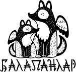

# Проект: веб-сайт Балапанлар
Балапанлар - летняя творческая школа  

### Используемые технологии
- HTML5
- CSS3
- JS
- OOP
- Webpack
- Babel
- PostCSS

### Установка зависимостей
Для пользователей Yarn:
- `yarn` - первоначальная установка
- `yarn ci` - синхронизация с командой :)

Для пользователей npm:
- `npm install` - первоначальная установка
- `npm ci` - синхронизация с командой :)

### Работа с git
[Git guide](./docs/Commits.md)

### Запуск
- Для пользователей Yarn:
`yarn dev`

- Для пользователей npm:
`npm run dev`

### [GitHub Pages](https://frrenzy.github.io/balapanlar)

### Создатели
- [Иван Сизов](https://github.com/frrenzy)
- [Анастасия Назинцева](https://github.com/anastasiian3)
- [Иван Фонин](https://github.com/ivanfonin)
- [Кирилл Камратов](https://github.com/kirillkamratov)
- [Николай Бровкин](https://github.com/bronik04)
